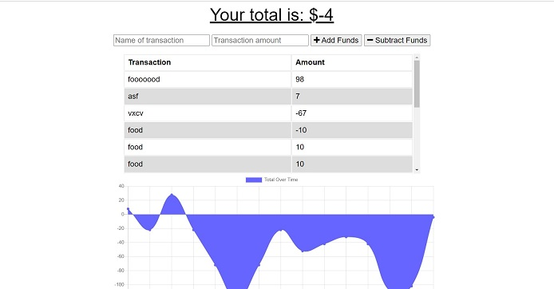

# budgetTracker
<h1 align=center>Budget Tracker</h1>

- Link to GitHub repository: https://github.com/Tzcodes101/budgetTracker
- Link to live site: https://whispering-ravine-59737.herokuapp.com/

## Description
This project enables a user to budget with offline funtionality. When a user adds or subtracts an expense, the transaction will be shown on the page, even without internet connection. The transaction will be added to their history when the connection is back online. 

## Table of Contents
- [Description](#Description)
- [Installation](#Installation)
- [Usage](#Usage)
- [License](#License)
- [Contributors](#Contributors)
- [Testing](#Testing)
- [Questions](#Questions)

## Installation
This application requires no installation.

## Usage
To use this project, a user must first access the application through https://whispering-ravine-59737.herokuapp.com/.

## License

This project is covered by the ISC license.

## Contributors
- Talia Zisman

## Testing
This project can be tested by following the usage instructions.

## Questions
Please e-mail the creator, Talia Zisman, of this readMeGenerator with any questions.
- E-mail: tzcodes101@gmail.com
- GitHub: [tzcodes101](http://github.com/tzcodes101)